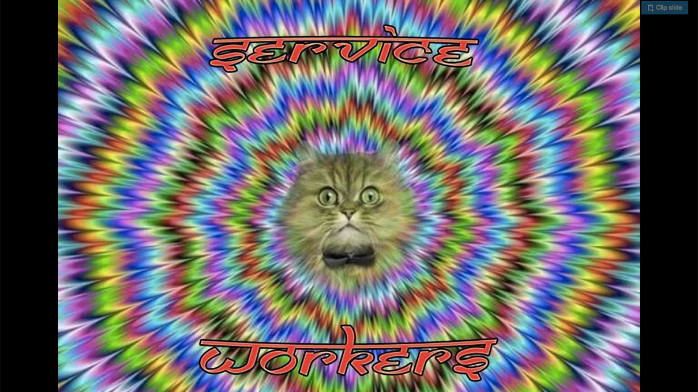
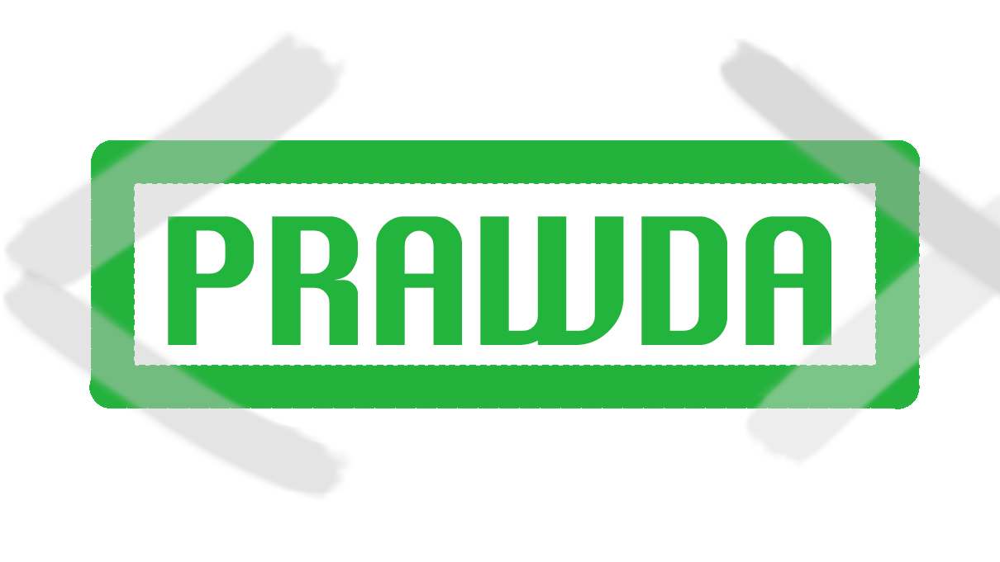
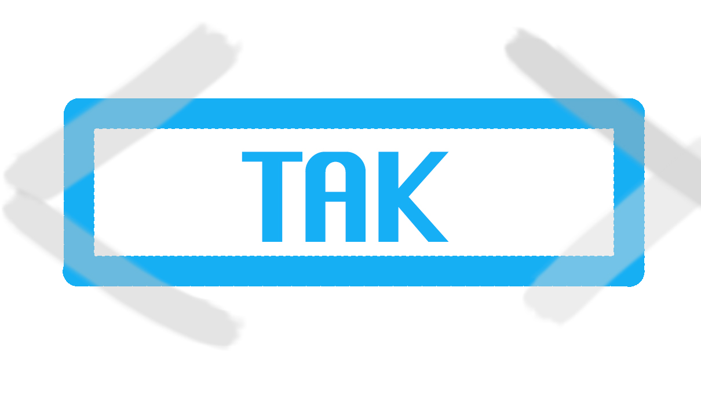
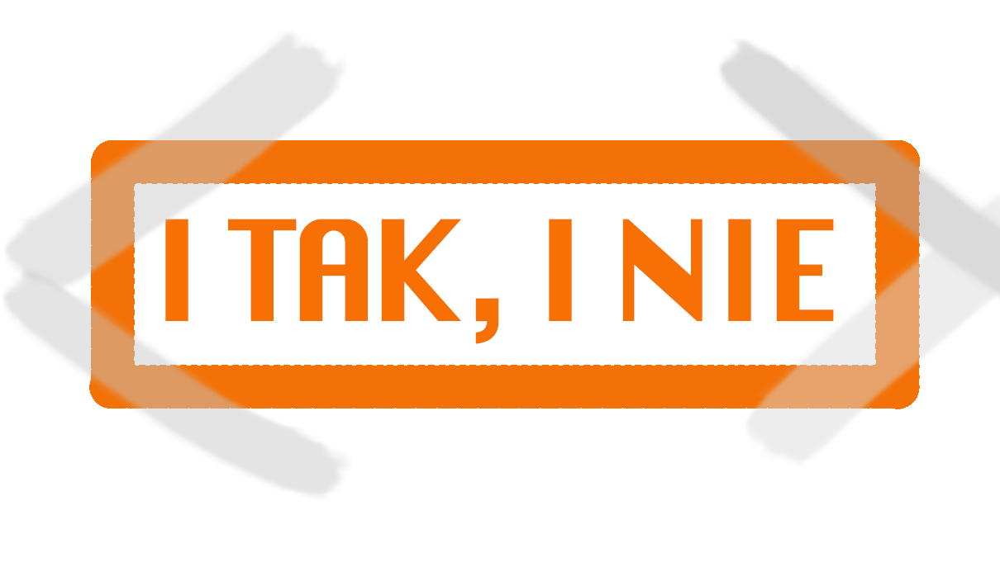
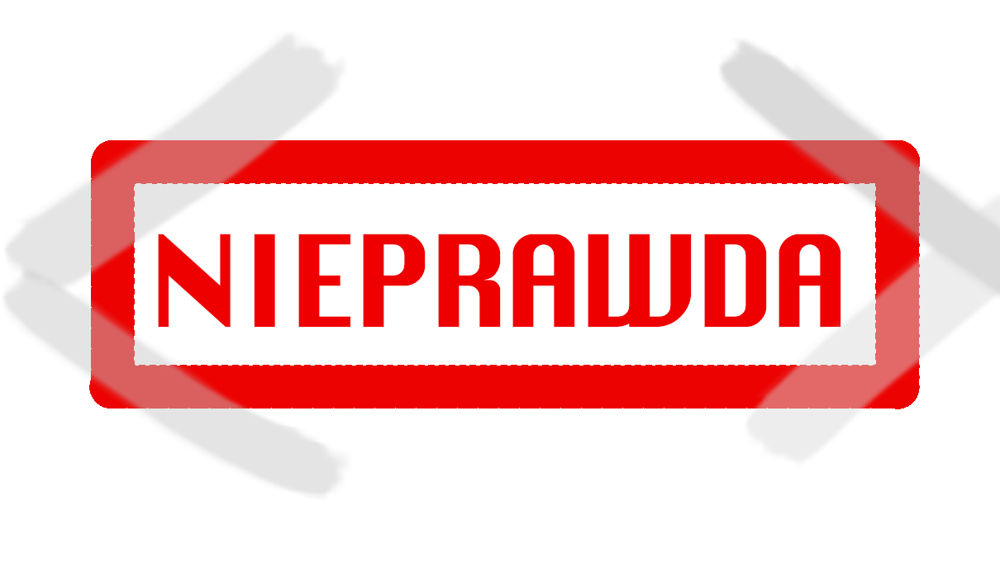

class: front-page

.logo[

]
.details[

## Piotr Kowalski
## <em>"Progressive Web Apps w szczegółach" [PL]</em>
## <small>2017-09-13</small>
## <a href="http://twitter.com/piecioshka">@piecioshka</a>
]

---

class: middle, slide-fullscreen-blockquote

> Największy problem w zrozumieniu <mark>Progressive Web Apps</mark> masz 
> wtedy, kiedy nie wiesz jak działają <em>Service Workery</em>, czyli tak jak ja.
> <small>Piotr Kowalski</small>

---

class: middle

.size130[
<strong>Prelekcja na podstawie filmu 🎬</strong>
]

---

class: slide-fullscreen-content

<iframe width="1210" height="681" src="https://www.youtube.com/embed/uRCCcae6BdM" frameborder="0" allowfullscreen></iframe>

---

class: middle

# Co to jest <mark>PWA</mark>s?

---

class: slide-fullscreen-content

<video src="videos/stawka-wieksza-niz-zycie/niebezpieczne-tematy.mov" controls preload="none"></video>

???

https://www.youtube.com/watch?v=0Sa1oymGYDc

---

class: middle

# Filary <mark>PWA</mark>

---

class: slide-fullscreen-content

<video src="videos/insights/pwa-1.mov" controls preload="none"></video>

---

class: middle

# 1. HTTPS <small>(🎬 no. 1)</small>

---

class: slide-fullscreen-content

<video src="videos/insights/pwa-2.mov" controls preload="none"></video>

---

class: middle

# 2. Service Worker <small>(🎬 no. 1)</small>

## (Offline mode, Cache API)

---

class: slide-fullscreen-content

---

class: slide-fullscreen-content

<video src="videos/insights/pwa-3.mov" controls preload="none"></video>

---

class: middle

# <mark>HINT</mark> Strona zadziała w trybie <em>offline</em>, kiedy wcześniej zostanie zapisana w <em>cache</em>-u <small>(🎬 no. 3)</small>

---

class: slide-fullscreen-content

<video src="videos/insights/pwa-4.mov" controls preload="none"></video>

---

class: center, middle
background-image: url(./images/rwd.png)

# 3. Accessibility <small>(🎬 no. 4)</small>

???

http://brolik.com/blog/responsive-web-design-examples-with-css-tips-and-tricks/

---

class: middle

# 4. Manifest.json

## Specyfikacja: [w3c.github.io/manifest](https://w3c.github.io/manifest/)

---

class: middle

# Cechy aplikacji <small>(🎬 no. 5)</small>

---

class: slide-fullscreen-content

<video src="videos/insights/pwa-5.mov" controls preload="none"></video>

---

class: right, no-after
background-image: url(./images/smutna-zaba.jpg)

# Aplikacja mobilne przestają być potrzebne <small>(🎬 no. 6)</small>

???

http://www.instalki.pl/aktualnosci/internet/23590-smutna-zaba-symbolem-nienawisci.html

---

class: slide-fullscreen-content

---

class: slide-fullscreen-content

<video src="videos/insights/pwa-6.mov" controls preload="none"></video>

---

class: middle

# Skrót do aplikacji <mark>PWA</mark> na pulpicie <small>(🎬 no. 7)</small>

---

class: slide-fullscreen-content

---

class: slide-fullscreen-content

<video src="videos/insights/pwa-7.mov" controls preload="none"></video>

---

class: middle

### <small>Użytkownicy Facebook-a mają wybór:</small> Czy ściągać i instalować aplikację mobilną? Czy jednak zapisać skrót na pulpicie?

.size50[
- Rozmiary: **aplikacja mobilna <em>100MB</em>** (po instalacji **<em>200MB</em>**)
- Skrót + cache Application Shella: **<mark>~2MB</mark>**
]

---

class: middle

# Przerobienie bloga na aplikację <mark>PWA</mark> <small>(🎬 no. 8)</small>

## [piecioshka.pl/blog](https://piecioshka.pl/blog)

---

class: slide-fullscreen-content

<video src="videos/insights/pwa-8.mov" controls preload="none"></video>

---

class: middle
    
# Artykuł <small>(🎬 no. 9)</small>

## [piecioshka.pl/blog/2017/05/07/jak-przerobic-strone-na-pwa.html](https://piecioshka.pl/blog/2017/05/07/jak-przerobic-strone-na-pwa.html)

---

class: slide-fullscreen-content

<video src="videos/insights/pwa-9.mov" controls preload="none"></video>

---

class: middle

# <em>Piotr</em>, czy pomożesz mi przerobić stronę na <mark>PWA</mark>? <small>(🎬 no. 10)</small>

---

class: slide-fullscreen-content

---

class: slide-fullscreen-content

<video src="videos/insights/pwa-10.mov" controls preload="none"></video>

---

class: middle

# Wystarczy <em>2h</em> aby każdą stroną przerobić na <mark>PWA</mark> <small>(🎬 no. 11)</small>

---

class: slide-fullscreen-content

---

class: slide-fullscreen-content

<video src="videos/insights/pwa-11.mov" controls preload="none"></video>

---

class: middle

# Minimalne wymagania - każdy sobie poradzi <small>(🎬 no. 12)</small>

---

class: slide-fullscreen-content

---

class: middle

# A) HTTPS

## Polecam: [CloudFlare](https://www.cloudflare.com/)

---

class: slide-fullscreen-content

<video src="videos/insights/pwa-12.mov" controls preload="none"></video>

---

class: middle

# B) Manifest.json <small>(🎬 no. 13)</small>

## ...nazwa, ikonki, kolorki

---

class: slide-fullscreen-content

<video src="videos/insights/pwa-13.mov" controls preload="none"></video>

---

class: middle

# C) Service Worker <small>(🎬 no. 14)</small>

---

class: slide-fullscreen-content

<video src="videos/insights/pwa-14.mov" controls preload="none"></video>

---

class: middle

# Strategie Cache-owania <small>(🎬 no. 15)</small>

---

class: middle

# 1. Static Cache-first

---

class: slide-fullscreen-content

<video src="videos/insights/pwa-15.mov" controls preload="none"></video>

---

class: middle

# 2. Network-first <small>(🎬 no. 16)</small>

## Taką strategię wykorzystałem na blogu.

---

class: slide-fullscreen-content

---

class: slide-fullscreen-content

<video src="videos/insights/pwa-16.mov" controls preload="none"></video>

---

class: middle

# 3. Cache-first + wersje <small>(🎬 no. 17)</small>

---

class: slide-fullscreen-content

<video src="videos/insights/pwa-17.mov" controls preload="none"></video>

---

class: middle

# Nie chcę używać tej strategii <small>(🎬 no. 18)</small>

---

class: slide-fullscreen-content

---

class: middle, slide-fullscreen-blockquote

> # TO JEST SUPER OPCJA
> <small>Piotr Kowalski (<em>wrzesień 2017</em>)</small>

---

class: slide-fullscreen-content

<video src="videos/insights/pwa-18.mov" controls preload="none"></video>

---

class: middle

# Moja strona jest na tyle <em>lekka</em>, że tworzenie request <em>nie zajmuje</em> dużo czasu <small>(🎬 no. 19)</small>

---

class: slide-fullscreen-content

---

class: middle, slide-fullscreen-blockquote

> # ZMIEŃ POŁĄCZENIE Z SIECIĄ NA <em>3G</em>, TO SIĘ PRZEKONASZ
> <small>Piotr Kowalski (<em>wrzesień 2017</em>)</small>

---

class: slide-fullscreen-content

<video src="videos/insights/pwa-19.mov" controls preload="none"></video>

---

class: middle

# Nie czuję, że potrzebuję korzystać ze strategii <em>Cache-first</em> <small>(🎬 no. 20)</small>

---

class: slide-fullscreen-content

---

class: middle, slide-fullscreen-blockquote

> 4 MIESIĄCE MINĘŁY I INACZEJ ŚPIEWASZ
> <small><em>Bruner</em> "Stawka Większa niż życie" 1967</small>

---

class: slide-fullscreen-content

<video src="videos/insights/pwa-20.mov" controls preload="none"></video>

---

class: middle

# Kto tego używa? <small>(🎬 no. 21)</small>

## Sklep internetowy [Ali Express](https://m.aliexpress.com/)

## Zanotowali <em>2x wzrost</em> konwersji (<em>2x więcej</em> odwiedzonych stron per sesja)

---

class: slide-fullscreen-content

<video src="videos/insights/pwa-21.mov" controls preload="none"></video>

---

class: middle

# Na blogu opisałem kroki przejścia strony WWW na aplikację <mark>PWA</mark> <small>(🎬 no. 22)</small>

## <em>TO MOŻE TERAZ WSPÓLNIE RAZEM TO ZROBIMY!</em>

---

class: slide-fullscreen-content

<video src="videos/insights/pwa-22.mov" controls preload="none"></video>

---

### Źródła

## 🔹Film: [youtube.com/watch?v=uRCCcae6BdM](http://www.youtube.com/watch?v=uRCCcae6BdM)

## 🔸Blog: [piecioshka.pl/blog](https://piecioshka.pl/blog/)

## 🔹Artykuł: [piecioshka.pl/blog/2017/05/07/jak-przerobic-strone-na-pwa.html](https://piecioshka.pl/blog/2017/05/07/jak-przerobic-strone-na-pwa.html)

---

class: middle, no-after

# Thanks.

## 🎂 See you next month at <em>WarsawJS</em> 🎂

.size40[
* on [GitHub](http://github.com/piecioshka)
* on [Twitter](http://twitter.com/piecioshka)
* on [Facebook](http://facebook.com/piecioshka)
]
